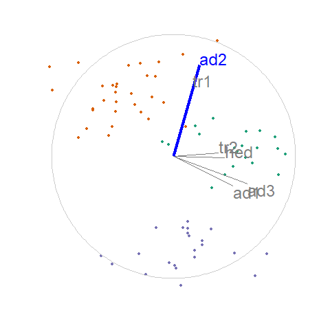
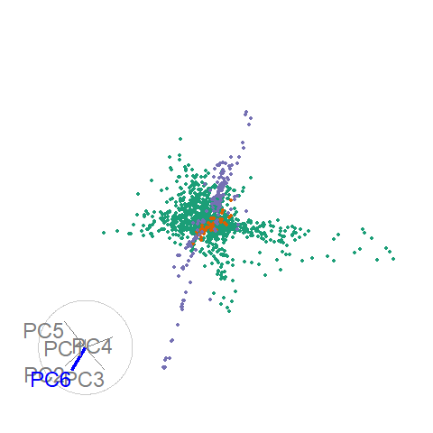

```{r setup_pres, include=FALSE}
knitr::opts_chunk$set(
  eval      = TRUE,  # R code 
  echo      = FALSE, # code text
  include   = TRUE,  # plots
  results   = 'asis', # text 'markup' 'asis' 'hold' 'hide'
  message   = F, warning = F, error = F, cache = F, cache.lazy = F,
  fig.align = "center",
  collapse  = TRUE
)

library(spinifex)
library(gganimate)
library(ggplot2)
library(magrittr)
library(knitr)
library(kableExtra)
```

## Motivation

Exploratory data analysis is important and ubiquitous, and it is important to keep visual interpretation: 


Datasaurus dozen; same means, standard deviations, and correlations, *(Matejka & Fitzmaurice, 2017)*

---

## Context: data analysis workflow

```{r, echo=F, out.width='80%', out.height='80%'}
knitr::include_graphics("./images_confirmation/data_analysis_workflow.png")
```
*Wickham & Grolemund, 2016*

- Visualization is a key aspect of data analysis workflow loop
- Reproducible from programmatic scripts (& reduced human error)
- Transparent research hosted publicly on [github](https://github.com/nspyrison).

---

## Visualizing multivariate spaces

- Visualization  multivariate space is complex; dimension reduction
- Static projections do not portray all of the variation in the data
- Dynamic rotations do convey more variation and more accurate structure

**Shadow puppet analogy (linear projection from 3- to 2D):**


---

## Dynamic linear projections, tours   

**Available on CRAN,** `tourr` R package, *(Wickham et al. 2011)*

- Random choice - *grand tour* random forest walk in $p$-space *(Asimov 1985)*
- Data-driven - *guided tour* projection pursuit, optimize an objective function on the projection *(Hurley & Buja 1990)*
- Many other geometric displays, this talk uses scatterplots

--

.pull-left[
.center[grand tour (random):]
```{r, echo=F, out.height= '70%', out.width='70%'}
knitr::include_graphics("./images_confirmation/flea_grand.gif")
```
]

--

.pull-right[
.center[guided tour - optimizing holes index:]
```{r, echo=F, out.height= '70%', out.width='70%'}
knitr::include_graphics("./images_confirmation/flea_holes.gif")
```
]

---

## Visualization dimension: 3D and immersive 3D 

Data visualization has lagged behind in adopting 3D and immersive technologies, despite promising finds

.pull-left[
```{r, out.width='90%', out.height='90%'}
knitr::include_graphics("./images_confirmation/nelson98fig.PNG")
```

*(Nelson et al. 1998)*
- tours: head-tracked VR vs standard monitor
- better cluster and shape identification, slower brushing
]

.pull-right[
3D visuals generally convey more information with more speed, but  manipulation is slower when compared with orthogonal 2D, though 3D with 2D gives the best perception *[Lee 1986, Wickens 1994, Tory 2006]*

Embedded multivariate data in immersive 3D report improved accuracy and faster response time, but a slower manipulation speed and less comfort *[Gracia 2016, Wagner 2018, Nelson 1998]*

Modern VR equipment has improved quality, attracted wider audiences, and reduced the costs of VR, it is timely to research dynamic projections in VR
]

---

## Research objectives
<hr><br>

### 1) How can user-controlled steering (UCS) be generalized to work within graphic-specific environments for 2D projections?
### 2) Does 2D UCS tours provide benefits over alternatives?
### 3) How do we extend UCS to 3D?
### 4) Does UCS in 3D displays provide benefits over 2D displays?


---

## RO 1) How can UCS be generalized to work within graphic-specific environments for 2D projections?

- *manual tour* user-controlled manipulation of a selected variable *(Cook & Buja 1997)*
    - Used to explore the sensitivity of the structure to the variables contributing to the projection
    
**Work in progress. Method: Algorithm design & paper to be submitted to the R Journal:**
- Algorithm generalizing for consumption by graphics environments
- R implementation via the package `spinifex`, available on [github.com/nspyrison/spinifex](https://github.com/nspyrison/spinifex)
    `devtools::install_github("nspyrison/spinifex")`
    - manual tours in R, extending the `tourr` package
    - platform to pass tours to animation-specific environments
- application to contemporary high energy physics

---

## RO1 Step 1) Choose a variable of interest

- Starting with the last projection of the previous holes-indexed guided tour:

```{r setup, results='hide'}
f_dat  <- tourr::rescale(tourr::flea[,1:6])
f_cat  <- factor(flea$species)
f_path <- save_history(f_dat, guided_tour(holes()))
f_bas  <- matrix(f_path[,, max(dim(f_path)[3])], ncol=2)
f_mvar <- 5
f_proj <- data.frame(tourr::rescale(f_dat %*% f_bas))
```

.pull-left[
.center[Projected data and reference axes]
```{r, fig.height=6, fig.width=12, out.height='130%', out.width='130%'}
view_basis(f_bas, lab = colnames(f_dat)) +
  geom_point(data = f_proj, size=3,
             mapping = aes(x = X1 - 2, y = X2 - .5, color = f_cat), 
             pch = as.integer(f_cat) + 15)

```
]

.pull-right[
.center[*XY* coefficients of each variable]
```{r}
rownames(f_bas) <- colnames(f_dat)
colnames(f_bas) <- c("x", "y")

f_bas %>% kable() %>% kable_styling()
```
]

- Choose a manipulation variable: `aede2`

---

## RO1 Step 2) Create a manipulation space

.pull-left[
```{r, out.height='80%', out.width='80%'}
view_manip_space(basis = f_bas, manip_var = f_mvar, labels = colnames(f_dat))
```
]

.pull-right[
<br><br>
- Orthonormalize a dimension with a full contribution to the manipulation variable
- This provides a means to rotate the basis out of the projection plane (for example, lifting paper off the table rather than being confined to the surface)
- Create a sequence of values for the 'out-of-plane' angle that will change the projection coefficients of the manipulation variable
]

---

## RO1 Step 3) Generate the rotation

*Over the sequence of angles:* rotate the manipulation space for each element

- Project the data
- Plot the first two variables of the rotated basis and projection

```{r, fig.hight=2, out.width='45%', out.height='45%'}
f_ang <- .15
f_mt <- manual_tour(basis = f_bas,manip_var = f_mvar,angle = f_ang)

flea_std <- tourr::rescale(tourr::flea[,1:6])
rb <- tourr::basis_random(n = ncol(flea_std))
theta <- runif(1, 0, 2*pi)
phi <- runif(1, 0, 2*pi)

oblique_frame(data = flea_std, basis = rb, manip_var = 4, theta, phi)


oblique_frame(basis = f_mt[,,1], data = f_dat, manip_var = f_mvar, 
              col = f_cat, pch = f_cat)


### Leaves white space across top+bot, alternatively can use screenshot:
#knitr::include_graphics("./images_confirmation/rotate_manip_sp.PNG")
```

---

## Display as an animation

- `aede2` is important for distinguishing between the green and purple clusters

```{r, results='hide'}
library(spinifex)
f_ang  <- .08
f_proj <- data.frame(tourr::rescale(f_dat %*% f_bas))

### GGANIMATE
f_mt <- play_manual_tour(data = f_dat, basis = f_bas, manip_var = f_mvar,
                         angle = f_ang, col = f_cat,
                         render_type = render_gganimate)

gganimate::anim_save(filename = "./images_confirmation/f_mt.gif", animation = f_mt,
                     start_pause = 15, width = 480, height = 480, res = 150)
```
```{r, out.width='37%', out.height='37%'}

```

As an [html widget](https://nspyrison.netlify.com/thesis/flea_manualtour_mvar5/)


---

## Application -- high energy physics

Hadronic collision experiment data, $\textbf{X} \in \mathbb{R}^{56}$, *(Wang, et al. 2018)*, studied with guided tours *(Cook, et al. 2018)*

.pull-left[
```{r, results='hide'}
##DIS cluster, fig 8 of cook_dynamical_2018
load("./data_confirmation/grDIScenter.rda")
load("./data_confirmation/DIScluster_centered_basis.rda")
DIS_bas  <- DIScluster_centered_basis
DIS_dat  <- tourr::rescale(grDIScenter[, 1:6])
DIS_cat  <- factor(grDIScenter$disID)
DIS_mvar <- 6
DIS_ang  <- .15

### GGANIMATE

DIS_mt <- 
  play_manual_tour(data = DIS_dat, basis = DIS_bas, manip_var = DIS_mvar,
                   angle = DIS_ang, axes="bottomleft", col = DIS_cat,
                   render_type = render_gganimate)

gganimate::anim_save(filename = "./images_confirmation/DIS_mt.gif", animation = DIS_mt,
                     start_pause = 15, width = 480, height = 480, res = 150)
```
```{r, out.width='80%', out.height='80%'}

```

As an [html widget](https://nspyrison.netlify.com/thesis/discluster_manualtour_pc6/), UCS on each of the 6 components
]

.pull-right[
Given:
- Data summarized in 6 principal components, ~48% of the variation
- Starting basis from previously published figures

Conclusion, PC6 is important in explaining the structural features in the data:
- When the contribution of PC6 is full, the plane of green points extends into the line of sight
- When the contribution is zeroed, the line of purple points is approaching a head-on view
]


---

## RO 2) What benefits does UCS provide over alternatives?

**Future work, method: performance comparison assessed across benchmark datasets**

- Principal Component Analysis (PCA) 
    - A linear transformation that produces linear combinations of the variables in descending order of variation explained
- Multi-Dimensional Scaling (MDS)
    - Non-linear dimension reduction that compares the pairwise distance between observations
- T-distributed Stochastic Neighbor Embedding (tSNE)
    - Non-linear transformation preserves local proximity and reduces relative entropy
- User-controlled steering (USC), manual tour
    - Dynamic linear projections controlling the contribution of a selected variable

Measures: variation, variable transparency, clustering, structure

Design space: data sets, techniques, and measures of comparison

---

## RO 3) How do we extend UCS to 3D?

**Future work, method: algorithm design**

Extend the UCS algorithm to 3D projections and integrate with Immersive Analytics Tool Kit, `IATK`, *(Cordeil 2019)* for a common user interface across display devices.

- Extend manipulation spaces to 4D, for variable manipulation on 3D scatterplots 
- multi-dimensional function surfaces

.pull-left[
```{r, out.width='70%', out.height='70%'}

```
]

.pull-right[
```{r, out.width='80%', out.height='80%'}
knitr::include_graphics("./images_confirmation/RO3MockUp2.PNG")
```
]

---

## RO 3) How do we extend UCS to 3D? (& function surfaces)

**Future work, method: algorithm design**

- multi-dimensional function surfaces

.pull-left[
```{r, out.width='70%', out.height='70%'}

```
]

.pull-right[
```{r, out.width='80%', out.height='80%'}
knitr::include_graphics("./images_confirmation/rgl_surface.PNG")
```
]

---

## RO 4) Does UCS in 3D displays provide benefits over 2D displays?

**Future work, method: usability study**

.pull-left[
lineup design *(Hofmann et al. 2012)*
- Visual variant of statistical p-test
- Pick the real data against data generated from the null hypothesis
- Quantitative comparison across display type

]

.pull-right[
Design space:
- Display type: 2D monitor, 3D monitor, head-mount, physical immersion
- Task type: structure, UCS, clustering, dimensionality
- Measures: accuracy, speed, confidence, preference, demographic information, VR and data visualization experience
]

---

## Contributions
<hr><br>

### 1) A modified UCS algorithm and new implementation applied to contemporary high energy physics and astrophysics applications in 2D animation frameworks.
### 2) A performance comparison of static and interactive UCS projection techniques assessed on benchmark data sets from the recent literature.
### 3) A new algorithm for UCS in 3D. With new applications to multi-dimensional function visualization in 3D.
### 4) Quantitative understanding of the relative benefits of UCS across 2- and 3D display devices.

---

### Research timeline

```{r timeline, echo=F, fig.height=8, fig.width=14}
#out.extra='angle=90
## working from: https://stats.andrewheiss.com/misc/gantt.html
library(tidyverse)
library(lubridate)
library(scales)

tasks <- tribble(
  ~Start,       ~End,         ~Project,     ~Task,
  "2018-04-01", "2019-06-01", "1) 2D UCS",  "1) 2D UCS",
  "2018-04-01", "2019-02-01", "1) 2D UCS",  "1) code",
  "2018-12-01", "2019-06-01", "1) 2D UCS",  "1) paper (The R journal)",
  "2019-01-01", "2019-03-01", "Milestones", "Candidature confirmation",

  "2019-03-01", "2019-12-01", "3) 3D UCS",  "3) 3D UCS",
  "2019-03-01", "2019-08-01", "3) 3D UCS",  "3) code",
  "2019-06-01", "2019-12-01", "3) 3D UCS",  "3) paper (VAST)",
  "2020-01-01", "2020-03-01", "Milestones", "Mid candidature review",

  "2019-10-01", "2020-09-01", "4) UCS 2D vs 3D", "4) UCS across display type",
  "2019-10-01", "2020-02-01", "4) UCS 2D vs 3D", "4) code",
  "2020-01-01", "2020-04-01", "4) UCS 2D vs 3D", "4) experimental survey",
  "2020-03-01", "2020-09-01", "4) UCS 2D vs 3D", "4) paper (CHI)",

  "2020-04-01", "2020-12-01", "2) 2D UCS vs alts", "2) UCS vs alternatives",
  "2020-04-01", "2020-08-01", "2) 2D UCS vs alts", "2) code",
  "2020-06-01", "2020-12-01", "2) 2D UCS vs alts", "2) paper (VAST)",
  
  "2020-11-01", "2021-03-01", "Milestones", "pre-submission presentation",
  "2020-09-01", "2021-04-01", "Milestones", "thesis composition"
)

# Convert data to long for ggplot
tasks.long <- tasks %>%
  mutate(Start = ymd(Start),
         End = ymd(End)) %>%
  gather(date.type, task.date, -c(Project, Task)) %>%
  #arrange(date.type, task.date) %>%
  mutate(Task = factor(Task, levels=rev(unique(Task)), ordered=T))
# Custom theme for making a clean Gantt chart
theme_gantt <- function(base_size=11) {
  ret <- theme_bw(base_size) %+replace%
    theme(panel.background = element_rect(fill="#ffffff", colour=NA),
          axis.title.x=element_text(vjust=-0.2), axis.title.y=element_text(vjust=1.5),
          title=element_text(vjust=1.2),
          panel.border = element_blank(), axis.line=element_blank(),
          panel.grid.minor=element_blank(),
          panel.grid.major.y = element_blank(),
          panel.grid.major.x = element_line(size=0.5, colour="grey80"),
          axis.ticks=element_blank(),
          legend.position="bottom",
          axis.title=element_text(size=rel(0.8)),
          strip.text=element_text(size=rel(1)),
          strip.background=element_rect(fill="#ffffff", colour=NA),
          panel.spacing.y=unit(1.5, "lines"),
          legend.key = element_blank())

  ret
}

# Calculate where to put the dotted lines that show up every three entries
x.breaks <- seq(length(tasks$Task) + 0.5 - 3, 0, by=-3)

# Build plot
timeline <- ggplot(tasks.long, aes(x=Task, y=task.date, colour=Project)) +
  geom_line(size=6) +
  geom_vline(xintercept=x.breaks, colour="grey80", linetype="dotted") +
  guides(colour=guide_legend(title=NULL)) +
  labs(x=NULL, y=NULL) + coord_flip() +
  scale_y_date(date_breaks="2 months", labels=date_format("%b ‘%y")) +
  theme_gantt() + theme(axis.text.x=element_text(angle=45, hjust=1)) +
  scale_color_brewer(palette = "Dark2") +
  theme(axis.text.x = element_text(size = 16),
        axis.text.y = element_text(size = 16),
        legend.text = element_text(size = 16))

timeline
```

---
class: center, middle

## Thanks!

Slides created in R using rmarkdown and xaringan

Slides -- [github.com/nspyrison/confirmation_talk]( https://github.com/nspyrison/confirmation_talk)

.large[Questions?]
<br><br><br><br>

.left[
*R Core Team, 2018*

*Xie et al. 2018*

*Xie, 2018*
]

---

## References (1/3)

*In order of appearance:*

Matejka, J., & Fitzmaurice, G. (2017). Same Stats, Different Graphs: Generating Datasets with Varied Appearance and Identical Statistics through Simulated Annealing. In Proceedings of the 2017 CHI Conference on Human Factors in Computing Systems  - CHI ’17 (pp. 1290–1294). Denver, Colorado, USA: ACM Press. https://doi.org/10.1145/3025453.3025912

Wickham, H., & Grolemund, G. (2016). R for Data Science: Import, Tidy, Transform, Visualize, and Model Data. O’Reilly Media, Inc.

Wickham, H., Cook, D., Hofmann, H., & Buja, A. (2011). tourr : An R Package for Exploring Multivariate Data with Projections. Journal of Statistical Software, 40(2). https://doi.org/10.18637/jss.v040.i02

Asimov, D. (1985). The Grand Tour: a Tool for Viewing Multidimensional Data. SIAM Journal on Scientific and Statistical Computing, 6(1), 128–143.

Hurley, C., & Buja, A. (1990). Analyzing High-Dimensional Data with Motion Graphics. SIAM Journal on Scientific and Statistical Computing, 11(6), 1193–1211. https://doi.org/10.1137/0911068

Nelson, L., Cook, D., & Cruz-Neira, C. (1998). XGobi vs the C2: Results of an Experiment Comparing Data Visualization in a 3-D Immersive Virtual Reality Environment with a 2-D Workstation Display. Computational Statistics, 14(1), 39–52.

---

## References (2/3)

Lee, J. M., MacLachlan, J., & Wallace, W. A. (1986). The Effects of 3D Imagery on Managerial Data Interpretation. MIS Quarterly, 257–269.

Wickens, C. D., Merwin, D. H., & Lin, E. L. (1994). Implications of Graphics Enhancements for the Visualization of Scientific Data: Dimensional Integrality, Stereopsis, Motion, and Mesh. Human Factors, 36(1), 44–61.

Tory, M., Kirkpatrick, A. E., Atkins, M. S., & Moller, T. (2006). Visualization Task Performance with 2D, 3D, and Combination Displays. IEEE Transactions on Visualization and Computer Graphics, 12(1), 2–13.

Gracia, A., González, S., Robles, V., Menasalvas, E., & von Landesberger, T. (2016). New Insights into the Suitability of the Third Dimension for Visualizing Multivariate/Multidimensional Data: A Study Based on Loss of Quality Quantification. Information Visualization, 15(1), 3–30. https://doi.org/10.1177/1473871614556393

Wagner Filho, J., Rey, M., Freitas, C., & Nedel, L. (2018). Immersive Visualization of Abstract Information: An Evaluation on Dimensionally-Reduced Data Scatterplots.

Cook, D., & Buja, A. (1997). Manual Controls for High-Dimensional Data Projections. Journal of Computational and Graphical Statistics, 6(4), 464–480. https://doi.org/10.2307/1390747

---

## References (3/3)

Wang, B.-T., Hobbs, T. J., Doyle, S., Gao, J., Hou, T.-J., Nadolsky, P. M., & Olness, F. I. (2018). Visualizing the sensitivity of hadronic experiments to nucleon structure. ArXiv Preprint ArXiv:1803.02777.

Cook, D., Laa, U., & Valencia, G. (2018). Dynamical projections for the visualization of PDFSense data. Eur. Phys. J. C, 78(9), 742.

Cordeil, M. (2019). Immersive Analytics Toolkit (Version IATK 1.0 (Mala) Unity 2017). Retrieved from https://github.com/MaximeCordeil/IATK (Original work published 2017)

Hofmann, H., Follett, L., Majumder, M., & Cook, D. (2012). Graphical tests for power comparison of competing designs. IEEE Transactions on Visualization and Computer Graphics, 18(12), 2441–2448.

R Core Team. (2018). R: A Language and Environment for Statistical Computing. Vienna, Austria: R Foundation for Statistical Computing. Retrieved from https://www.R-project.org/

Xie, Y., Allaire, J. J., & Grolemund, G. (2018). R Markdown: The Definitive Guide. Boca Raton, Florida: Chapman and Hall/CRC. Retrieved from https://bookdown.org/yihui/rmarkdown

Xie, Y. (2018). xaringan: Presentation Ninja. Retrieved from https://CRAN.R-project.org/package=xaringan